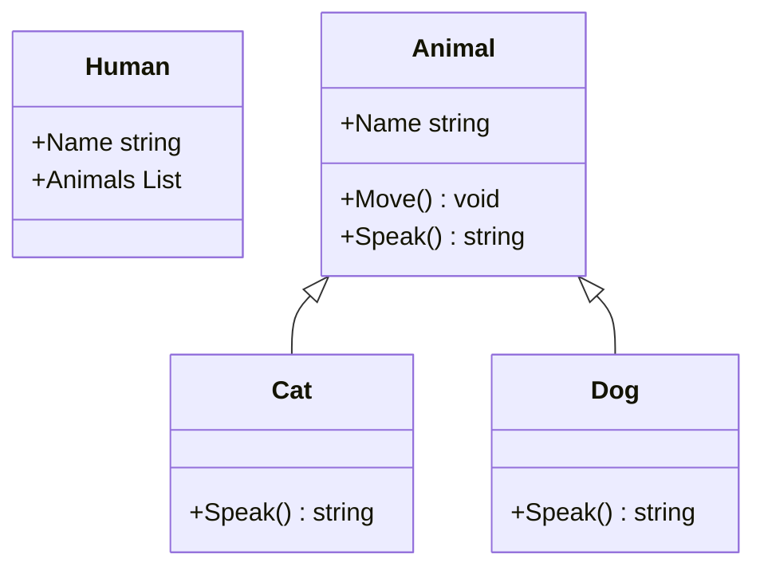

```mermaid
classDiagram
class Human{
+Name string
+Animals List<Animal>
}
Animal  <|-- Cat
class Cat{
+Speak() string
}
class Animal{
+Name string
+Move() void
+Speak() string
}
Animal  <|-- Dog
class Dog{
+Speak() string
}
```
